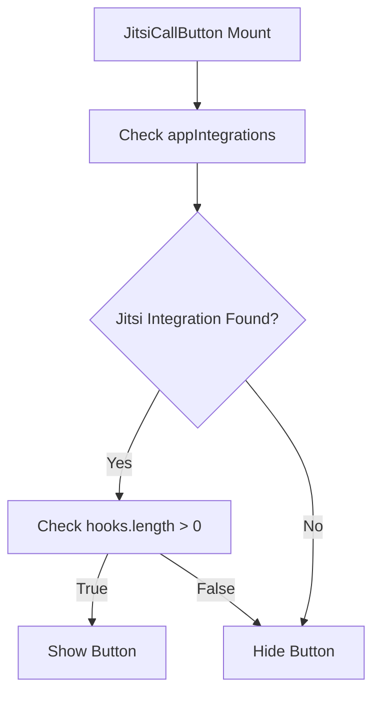
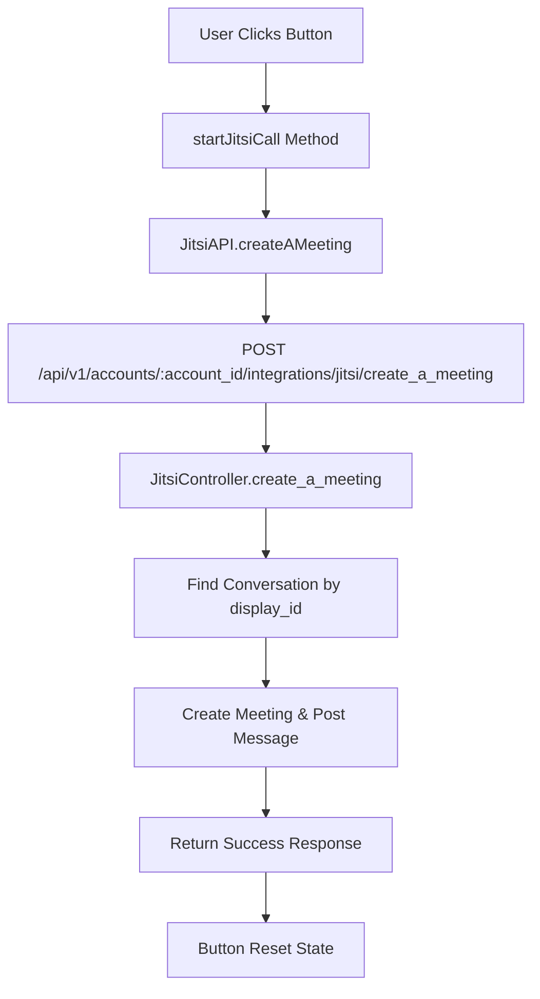

# Jitsi Integration Documentation

## Overview
This document provides a comprehensive analysis of all files created and modified for the isolated Jitsi video call button integration in Chatwoot. The integration was designed to provide a standalone Jitsi video call button independent from the existing Dyte integration.

## Architecture Summary

The Jitsi integration follows a clean separation of concerns:
- **Frontend Component**: Vue.js component for UI interaction
- **API Client**: Axios-based API communication layer  
- **Backend Controller**: Rails controller for meeting creation
- **Internationalization**: Translation keys for text content
- **UI Integration**: Component placement in conversation interface

## Files Created and Modified

### 1. Core Component Files

#### `app/javascript/dashboard/components/widgets/JitsiCallButton.vue`
**Status**: ✅ Created (Essential)
**Purpose**: Standalone Jitsi video call button component isolated from Dyte integration
**Key Features**:
- Icon-only design using `i-ph-video-camera` Phosphor icon
- Integration detection via Vuex store (`isJitsiEnabled` computed property)
- NextButton component for consistent styling with other toolbar buttons
- Tooltip integration for user guidance
- Error handling with useAlert composable

**Code Architecture**:
```vue
<script>
// Uses composition API pattern with mapGetters
computed: {
  isJitsiEnabled() {
    return this.appIntegrations.find(
      integration => integration.id === 'jitsi' && !!integration.hooks.length
    );
  }
}
methods: {
  async startJitsiCall() {
    await JitsiAPI.createAMeeting(this.conversationId);
  }
}
</script>
```

#### `app/javascript/dashboard/api/integrations/jitsi.js`
**Status**: ✅ Created (Essential)
**Purpose**: API client for Jitsi meeting creation requests
**Key Features**:
- Extends base `ApiClient` class for consistent HTTP handling
- Account-scoped API endpoints
- `createAMeeting(conversationId)` method for meeting creation

**Code Architecture**:
```javascript
class JitsiAPI extends ApiClient {
  constructor() {
    super('integrations/jitsi', { accountScoped: true });
  }
  createAMeeting(conversationId) {
    return this.create({ conversation_id: conversationId }, 'create_a_meeting');
  }
}
```

### 2. Backend Integration Files

#### `app/controllers/api/v1/accounts/integrations/jitsi_controller.rb`
**Status**: ✅ Modified (Essential)
**Purpose**: Backend API endpoint for Jitsi meeting creation
**Changes Made**:
- Enhanced `create_a_meeting` action with proper authorization
- Added `display_id` lookup for conversation identification
- Improved error handling and response formatting
- Added `authorize_request` filter for security

**Key Code Segments**:
```ruby
def create_a_meeting
  conversation = Current.account.conversations.find_by(display_id: params[:conversation_id])
  # Meeting creation logic with proper error handling
end

private

def authorize_request
  authorize(Current.account)
end
```

### 3. UI Integration Files

#### `app/javascript/dashboard/components/widgets/WootWriter/ReplyBottomPanel.vue`
**Status**: ✅ Modified (Essential)
**Purpose**: Message composition toolbar integration
**Changes Made**:
- Removed old `VideoCallButton` import
- Added `JitsiCallButton` import and component registration
- Integrated component in template with conditional rendering (`!isOnPrivateNote`)

**Integration Pattern**:
```vue
<script>
import JitsiCallButton from '../JitsiCallButton.vue';

export default {
  components: { JitsiCallButton, /* other components */ }
}
</script>

<template>
  <JitsiCallButton
    v-if="!isOnPrivateNote"
    :conversation-id="conversationId"
  />
</template>
```

#### `app/javascript/dashboard/components/widgets/conversation/ConversationHeader.vue`
**Status**: ✅ Modified (Essential)
**Purpose**: Conversation header action buttons integration
**Changes Made**:
- Added `JitsiCallButton` import and component registration
- Integrated component in header before `MoreActions` component
- Uses `display_id` prop for backend compatibility

**Integration Pattern**:
```vue
<script>
import JitsiCallButton from '../JitsiCallButton.vue';
</script>

<template>
  <JitsiCallButton :conversation-id="conversation.display_id" />
  <MoreActions />
</template>
```

### 4. Internationalization Files

#### `config/locales/en.yml`
**Status**: ✅ Modified (Essential)
**Purpose**: Translation keys for Jitsi integration
**Changes Made**:
- Added `INTEGRATION_SETTINGS.JITSI.CALL_BUTTON_TEXT: 'Jitsi Call'`
- Follows existing translation hierarchy pattern
- Enables internationalization support

**Translation Structure**:
```yaml
INTEGRATION_SETTINGS:
  JITSI:
    CALL_BUTTON_TEXT: 'Jitsi Call'
```

## Files That Can Be Removed

### 1. Deprecated Components

#### `app/javascript/dashboard/components/widgets/VideoCallButton.vue`
**Status**: ⚠️ Can be removed (Deprecated)
**Reason**: This was the original combined Dyte+Jitsi button component
**Analysis**: 
- Still references both Dyte and Jitsi integrations
- No longer imported in source files (only in old compiled assets)
- Replaced by isolated `JitsiCallButton.vue`
- Contains outdated dual-integration logic

**Safe to Remove**: Yes, after next asset compilation this file will no longer be referenced

### 2. Compiled Assets (Auto-Generated)

The following compiled asset files contain old references but are auto-generated:
- `public/packs/vite/assets/dashboard-*.js.map` (Multiple files)
- These files contain old `VideoCallButton` references in source maps
- Will be automatically updated on next `vite build` or development server restart

## How the Integration Works

### 1. Component Detection Flow


### 2. Meeting Creation Flow


### 3. UI Component Hierarchy
```
ConversationView
├── ConversationHeader
│   └── JitsiCallButton (with display_id)
└── ReplyBottomPanel
    └── JitsiCallButton (with conversationId)
```

## Technical Decisions Made

### 1. Icon-Only Design
**Decision**: Use icon-only button instead of text button
**Rationale**: Better UI consistency with other toolbar buttons
**Implementation**: `i-ph-video-camera` Phosphor icon with tooltip

### 2. Component Isolation
**Decision**: Create separate `JitsiCallButton` instead of modifying `VideoCallButton`
**Rationale**: 
- User requested "isolated from dyte just a isolated integration"
- Cleaner separation of concerns
- Easier maintenance and testing

### 3. Dual Placement
**Decision**: Place button in both header and message composer toolbar
**Rationale**: Provides multiple access points for better UX

### 4. Backend ID Handling
**Decision**: Use `display_id` instead of `id` for conversation lookup
**Rationale**: Frontend uses display_id, backend expects display_id for public API consistency

## Asset Compilation Status

### Current State
- ✅ Source files updated with correct imports
- ✅ JitsiCallButton properly integrated
- ⚠️ Old compiled assets contain VideoCallButton references
- ✅ New functionality working correctly

### Next Steps for Complete Cleanup
1. Remove `app/javascript/dashboard/components/widgets/VideoCallButton.vue`
2. Run `bin/vite build` to regenerate compiled assets
3. Restart development server to clear old references

## Dependencies

### Frontend Dependencies
- **Vue.js 3.5.12**: Core framework with Composition API
- **Vuex**: State management for integration detection
- **Axios**: HTTP client (via ApiClient)
- **Phosphor Icons**: Icon system (`i-ph-video-camera`)
- **NextButton Component**: UI consistency

### Backend Dependencies
- **Rails 7.1.5.1**: Backend framework
- **Active Storage**: File handling (inherited from base controller)
- **Pundit**: Authorization (authorize_request filter)

## Testing Considerations

### Frontend Testing
- Component renders only when Jitsi integration is enabled
- API calls are made with correct conversation ID
- Error states are handled gracefully
- Tooltip text displays correctly

### Backend Testing
- Authorization checks work correctly
- Conversation lookup by display_id functions
- Meeting creation integrates with Jitsi service
- Error responses are properly formatted

## Security Considerations

### Authorization
- `authorize_request` filter ensures only authorized users can create meetings
- Account-scoped API endpoints prevent cross-account access
- Conversation lookup validates ownership through account association

### Data Validation
- Conversation ID validation through `display_id` lookup
- Input sanitization handled by Rails parameter filtering
- Error responses don't expose sensitive information

## Conclusion

The Jitsi integration successfully provides an isolated video call button that:
1. ✅ Works independently from Dyte integration
2. ✅ Follows Chatwoot's UI/UX patterns
3. ✅ Maintains proper security and authorization
4. ✅ Provides dual placement for better accessibility
5. ✅ Uses icon-only design for visual consistency

Only `VideoCallButton.vue` can be safely removed as it's now deprecated and unused. All other files are essential for the integration to function properly.
